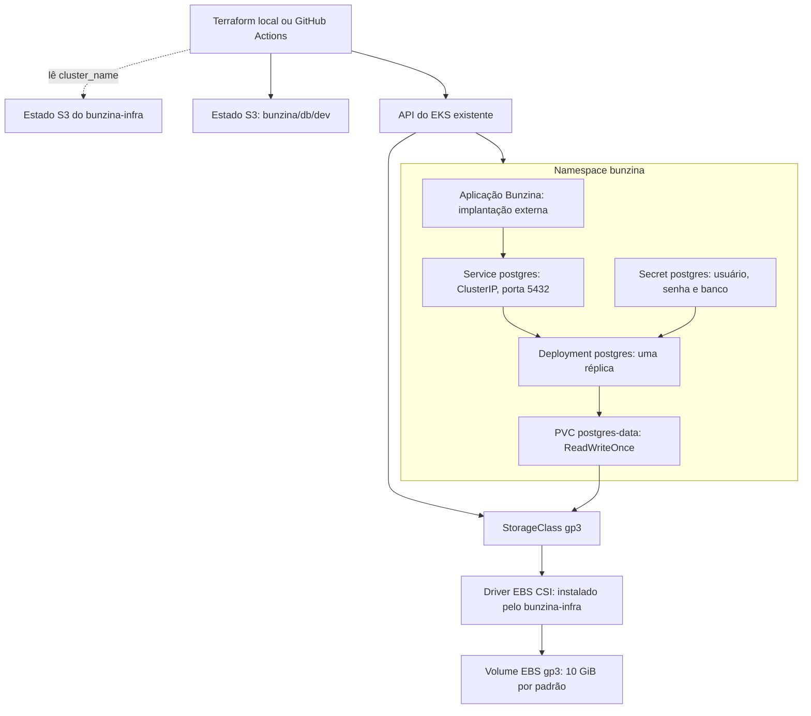

# bunzina-db

## Propósito

Provisionar o PostgreSQL utilizado pelo Bunzina dentro de um cluster Amazon EKS existente. O Terraform gerencia o namespace, as credenciais, o armazenamento persistente, o Deployment e o serviço interno de acesso ao banco.

Este projeto depende do [bunzina-infra](https://github.com/Bunzina/bunzina-infra), que cria o cluster e instala o driver CSI do EBS. A ordem de implantação é **bunzina-infra → bunzina-db → [aplicação Bunzina](https://github.com/Bunzina/bunzina)**.

## Tecnologias utilizadas

| Tecnologia | Uso neste repositório |
| --- | --- |
| Terraform | Infraestrutura como código; mínimo declarado >= 1.6.0, workflow em 1.11.4 |
| Provider AWS `~> 5.0` | Consulta dos dados do cluster EKS |
| Provider Kubernetes `~> 2.38` | Gerenciamento dos recursos do banco no cluster |
| PostgreSQL 15 | Banco de dados; imagem padrão `postgres:15` |
| Kubernetes no Amazon EKS | Namespace, Secret, Deployment com uma réplica e Service ClusterIP |
| Amazon EBS gp3 | Armazenamento persistente via StorageClass e PVC |
| Amazon S3 | Estado Terraform deste projeto e leitura do estado de `bunzina-infra` |
| AWS CLI, kubectl e GitHub Actions | Autenticação, verificação e automação de deploy |

## Arquitetura



A StorageClass é criada no escopo do cluster e marcada como padrão. O volume é provisionado pelo driver EBS CSI quando houver um consumidor. O serviço `postgres` é acessível dentro do cluster; a aplicação pode usar `postgres.bunzina.svc.cluster.local:5432` com o namespace padrão.

## Pré-requisitos

- `bunzina-infra` aplicado, com estado no S3 contendo a saída `cluster_name`.
- Cluster EKS e driver EBS CSI operacionais.
- Terraform >= 1.11 para os comandos abaixo, que utilizam bloqueio de estado no S3 com `use_lockfile=true`; o workflow utiliza 1.11.4.
- AWS CLI instalada, credenciais AWS válidas e acesso ao bucket de estado e à API do cluster.
- Identidade autorizada no EKS. A infraestrutura atual concede acesso à role `voclabs`.
- kubectl para verificar a implantação e, opcionalmente, um cliente `psql` para testar a conexão.

## Execução e deploy local

Execute a partir da raiz deste repositório, depois de implantar o `bunzina-infra`.

### 1. Configurar credenciais e variáveis

Para credenciais temporárias do AWS Academy:

```bash
export AWS_ACCESS_KEY_ID="<chave-de-acesso>"
export AWS_SECRET_ACCESS_KEY="<chave-secreta>"
export AWS_SESSION_TOKEN="<token-da-sessao>"
export AWS_DEFAULT_REGION="us-east-1"
aws sts get-caller-identity

cp infra/terraform.tfvars.example infra/terraform.tfvars
export TF_STATE_BUCKET="bunzina-tfstate-$(aws sts get-caller-identity --query Account --output text)"
read -rsp 'Senha do PostgreSQL: ' TF_VAR_db_password
export TF_VAR_db_password
```

Edite `infra/terraform.tfvars`, substituindo o exemplo de `infra_state_bucket` pelo bucket real criado na implantação da infraestrutura. Esse campo aponta para o estado do `bunzina-infra`; `TF_STATE_BUCKET` indica onde salvar o estado deste projeto.

| Variável | Configuração |
| --- | --- |
| `infra_state_bucket` | Bucket que contém o estado do `bunzina-infra`; obrigatório |
| `infra_state_key` | Padrão: `bunzina/infra/dev/terraform.tfstate` |
| `aws_region` | Região do cluster e do estado da infraestrutura; padrão `us-east-1` |
| `environment` | `dev` ou `prod`; padrão `dev` |
| `kubernetes_namespace` | Padrão: `bunzina` |
| `postgres_image` | Padrão: `postgres:15` |
| `db_username` / `db_name` | Padrões: `bun` / `bunzina` |
| `storage_class_name` / `storage_size` | Padrões: `gp3` / 10 GiB |
| `db_password` | Fornecida por `TF_VAR_db_password`; use a mesma credencial na aplicação |

Como alternativa, forneça o bucket por `TF_VAR_infra_state_bucket`, removendo antes `infra_state_bucket` do `.tfvars`, pois o arquivo tem precedência sobre a variável de ambiente. Alterar `environment` não modifica automaticamente as chaves dos estados.

### 2. Inicializar, validar e planejar

O bucket de destino deve existir. Ele pode ser compartilhado com a infraestrutura, usando uma chave distinta:

```bash
cd infra
terraform init \
  -backend-config="bucket=$TF_STATE_BUCKET" \
  -backend-config="key=bunzina/db/dev/terraform.tfstate" \
  -backend-config="region=us-east-1" \
  -backend-config="encrypt=true" \
  -backend-config="use_lockfile=true"

terraform fmt -check -recursive
terraform validate
terraform plan
```

A senha precisa estar definida antes do `plan`. Não versione credenciais, `.tfvars` reais ou arquivos de estado. O Secret contém credenciais que também ficam registradas no estado Terraform; restrinja o acesso ao bucket.

### 3. Aplicar e verificar

```bash
terraform apply
terraform output
```

Revise o plano antes de confirmar a aplicação. As saídas informam o nome do serviço, namespace, nome do Secret e porta do PostgreSQL.

Configure o kubectl com o nome do cluster exibido pelo `bunzina-infra` e verifique os recursos (ajuste o namespace se necessário):

```bash
aws eks update-kubeconfig --name bunzina-eks --region us-east-1
kubectl rollout status deployment/postgres -n bunzina
kubectl get pods,svc,pvc -n bunzina
```

Para testar localmente, mantenha este comando em execução:

```bash
kubectl port-forward -n bunzina svc/postgres 5432:5432
```

Em outro terminal, conecte-se com a senha configurada:

```bash
psql -h 127.0.0.1 -p 5432 -U bun -d bunzina -W
```

## Deploy pelo GitHub Actions

O arquivo [terraform.yml](.github/workflows/terraform.yml) executa `fmt`, `init`, `validate` e `plan` em pull requests que alteram `infra/**` ou o próprio workflow e publica o plano no PR.

1. Configure os secrets `AWS_ACCESS_KEY_ID`, `AWS_SECRET_ACCESS_KEY`, `AWS_SESSION_TOKEN` e `DB_PASSWORD` no GitHub.
2. Confirme que o `bunzina-infra` já foi aplicado na mesma conta, com a chave de estado esperada.
3. Revise o plano do pull request.
4. Em **Actions → Terraform → Run workflow**, selecione a referência desejada e inicie o deploy manual.

O workflow descobre o ID da conta pelas credenciais, utiliza o bucket `bunzina-tfstate-<ID-da-conta>` e tenta criá-lo com versionamento habilitado. Salva o estado em `bunzina/db/dev/terraform.tfstate` e consulta, por padrão, `bunzina/infra/dev/terraform.tfstate` no mesmo bucket, em `us-east-1`.

O job de aplicação utiliza o ambiente GitHub `production` e executa `terraform apply -auto-approve -input=false`; esse nome de ambiente não muda as chaves de estado nem a variável `environment`. Arquivos `.tfvars` locais não são enviados ao workflow. A senha é injetada pelo secret `DB_PASSWORD`.

## Operação e remoção

O PostgreSQL utiliza uma única réplica. Backups, restauração, atualizações e alta disponibilidade precisam de procedimentos próprios. Alterar a senha no Secret não altera automaticamente a senha de um banco já inicializado no volume persistente.

Para remover o banco, execute `terraform destroy` em `infra/`, com backend e variáveis configurados. A exclusão do PVC pode remover o volume EBS e seus dados; faça o backup necessário antes. Remova os recursos deste repositório antes de destruir o cluster em `bunzina-infra`.
